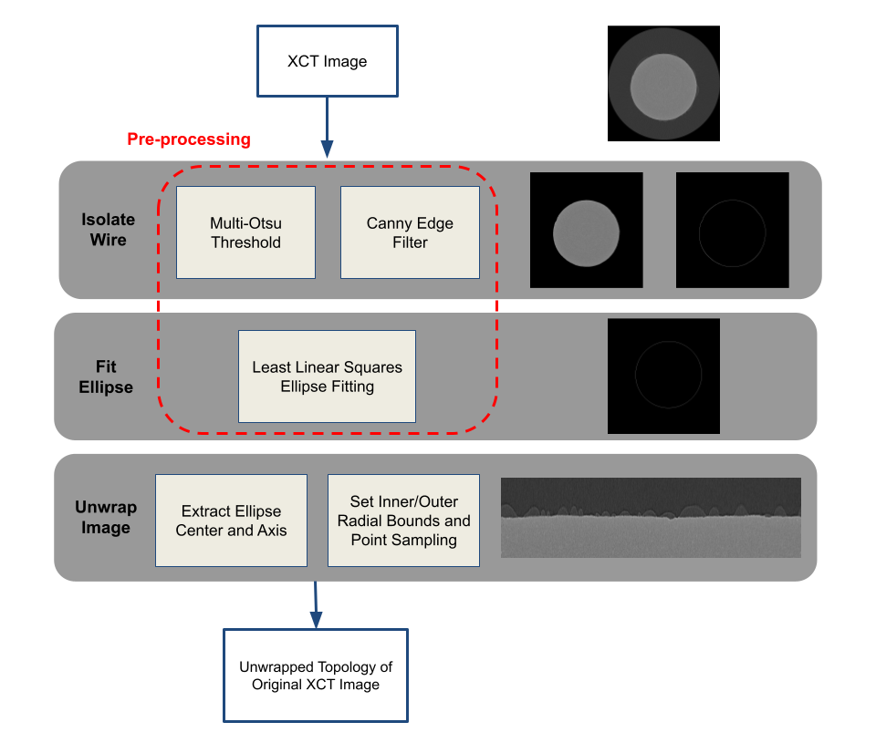

# pointextract
Polar to cartesian transforms using annular point sampling

Designed to unwrap 2D cross section images of 3D X-ray computed tomography scans.
The topological transformation enables the surface of a circular or elliptical object to be aligned for downsteam analysis.



## Installation

You can install the package with:
```bash
pip install pointextract
```

Before using this package, ensure you have Python installed on your system. This package requires the following dependencies:
- numpy
- skimage

## Example

Simple example:
```python
import pointextract
from skimage.io import imread

img_arr = imread('sample.png')

ellipse = ellipse_detect(img_arr, sigma=2)

img_unwrap = unwrap_image(img_arr, ellipse, radial_distance=50, num_points=400)
```

## Questions
This package is still in early development. Please feel free to post to the GitHub Issues page with questions.

## Acknowledgements
This material is based upon research in the Materials Data Science for Stockpile Stewardship Center of Excellence (MDS3-COE).

[Case Western Reserve University, SDLElab] [1]

[1]: http://sdle.case.edu
